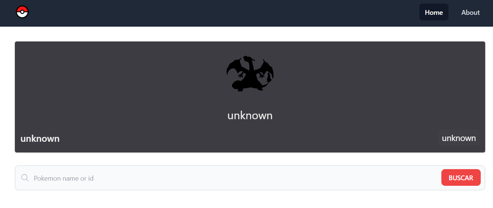
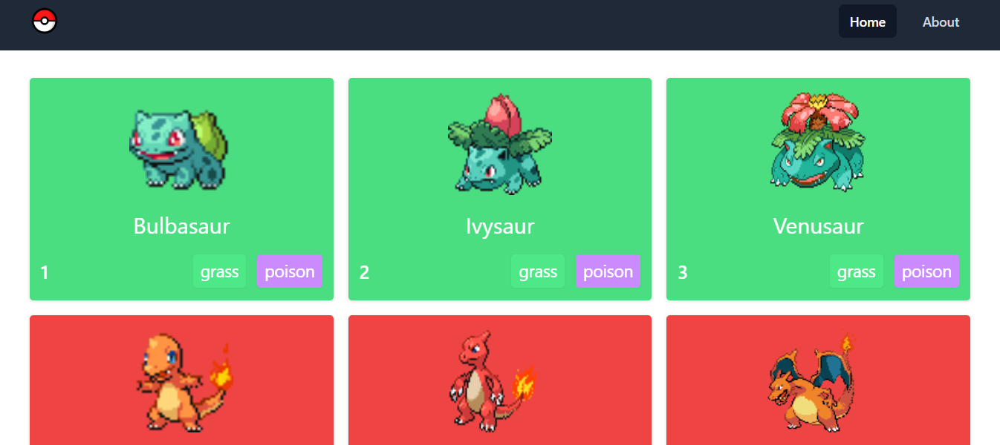
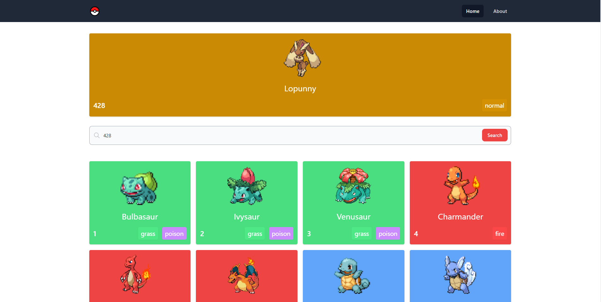
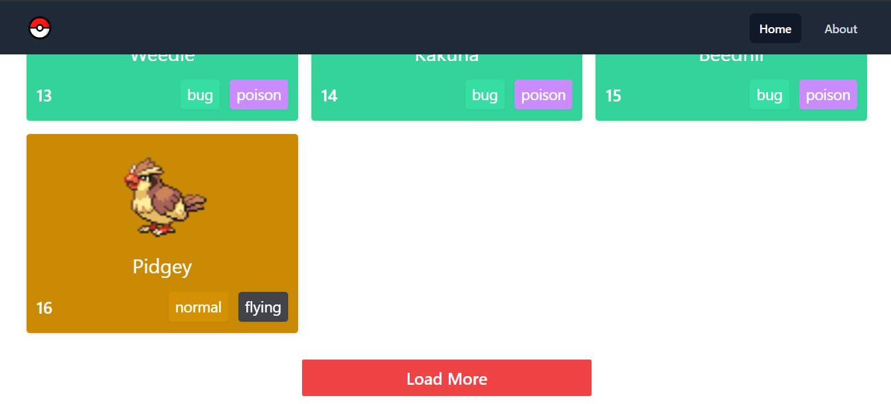
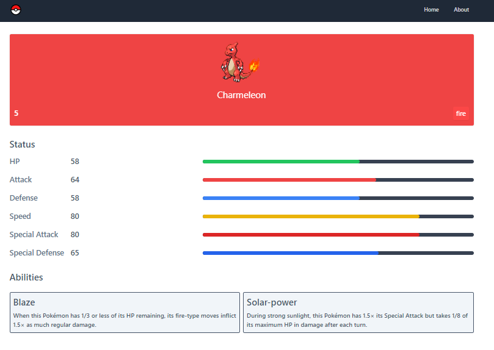

# POKENEXT
👨‍🏫APLICAÇÃO POKEDEX CRIADO PARA A VISUALIZAÇÃO DE POKÉMONS COM API POKEAPI.

 <br> 
 <br> 
 <br> 
 <br> 
 <br> 
 <br> 

## DESCRIÇÃO:
Este projeto é uma Pokédex interativa desenvolvida com Next.js e Tailwind CSS. Ele permite aos usuários visualizar uma lista de Pokémon, pesquisar por nome ou ID, e obter detalhes específicos de cada Pokémon, incluindo suas estatísticas, tipos e habilidades.

## FUNCIONALIDADES:
- **Listagem de Pokémon:** Carrega e exibe uma lista de Pokémon com informações básicas, como nome, tipo e imagem animada.
- **Pesquisa:** Permite aos usuários pesquisar Pokémon por nome ou ID.
- **Detalhes do Pokémon:** Fornece informações detalhadas de cada Pokémon, incluindo suas estatísticas (HP, Ataque, Defesa, etc.) e habilidades.
- **Carregamento Dinâmico:** Carrega mais Pokémon conforme o usuário rola ou clica em "Load More".
- **Navegação:** Utiliza o componente `Link` do Next.js para navegação entre as páginas.
- **getType:** Hook que retorna a classe CSS correspondente ao tipo do Pokémon.
- **capitalize:** Hook que capitaliza a primeira letra do nome do Pokémon.
- **PokemonDetails:** Componente que exibe detalhes do Pokémon pesquisado.
- **ThreeDots:** Componente de carregamento para indicar que os dados estão sendo carregados.
- **Páginas Dinâmicas:** Este projeto também inclui páginas dinâmicas para exibir detalhes específicos de cada Pokémon. As rotas dinâmicas são configuradas usando `getStaticPaths` e `getStaticProps` do Next.js para gerar páginas estáticas para cada Pokémon.

## EXECUTANDO O PROJETO:
1. **Instalar as dependências do projeto**:
   - Execute o comando no diretório `CODIGO/`:
     ```cmd
     npm install
     ```
   Este comando instala todas as dependências listadas no arquivo `package.json` do seu projeto. Certifique-se de estar no diretório do seu projeto ao executar este comando.

2. **Executando o Aplicativo:**
   - Para subir o servidor abra Terminal/CMD e digite o seguinte comando:
   ```bash
   npm run dev
   ```
   - Acesse o APP no navegador visitando [`http://localhost:3000/`](http://localhost:3000/).

## NÃO SABE?
- Entendemos que para manipular arquivos em `HTML`, `CSS` e outras linguagens relacionadas, é necessário possuir conhecimento nessas áreas. Para auxiliar nesse aprendizado, oferecemos cursos gratuitos disponíveis:
* [CURSO DE NEXTJS](https://github.com/VILHALVA/CURSO-DE-NEXTJS)
* [CURSO DE HTML E CSS](https://github.com/VILHALVA/CURSO-DE-HTML-E-CSS)
* [CURSO DE TYPESCRIPT](https://github.com/VILHALVA/CURSO-DE-TYPESCRIPT)
* [CURSO DE JAVASCRIPT](https://github.com/VILHALVA/CURSO-DE-JAVASCRIPT)
* [CURSO DE NODEJS](https://github.com/VILHALVA/CURSO-DE-NODEJS)
* [CONFIRA MAIS CURSOS](https://github.com/VILHALVA?tab=repositories&q=+topic:CURSO)

## CREDITOS:
- [PROJETO CRIADO PELO "kevinLyf"](https://github.com/kevinLyf/pokenext)
- [PROJETO EDITADO PELO VILHALVA](https://github.com/VILHALVA)


